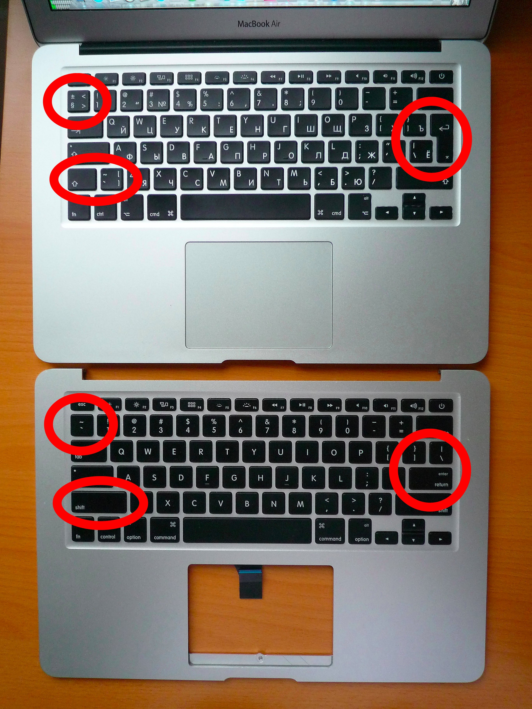
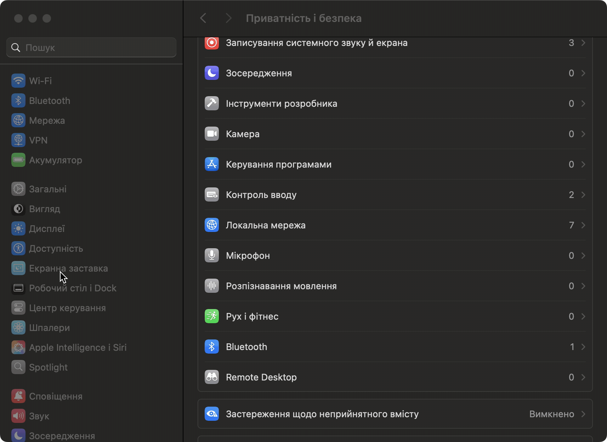

Макбук з європейською клавіатурою відрізняється від американської розташуванням деяких клавіш.



І якщо форма клавіші "Enter" та розташування "Backslash" мене якось не зачіпають, то знак `~` для мене особисто одна з найчастіше використовуваних клавіш. І через те що вона розташована внизу замість гори, мені доводиться викручувати собі пальці кожного разу. Тож я знайшов спосіб як "повернути" її на своє нормальне місце.

<!--more-->

## Є така вбудована утиліта `hidutil`

За допомогою однієї єдиної команди можно перевизначити розташування клавіш.

```sh
hidutil property --matching '{"VendorID":1452,"ProductID":833}' --set '{"UserKeyMapping":[{"HIDKeyboardModifierMappingSrc":0x700000035,"HIDKeyboardModifierMappingDst":0x700000064},{"HIDKeyboardModifierMappingSrc":0x700000064,"HIDKeyboardModifierMappingDst":0x700000035}]}'
```

Це перемикає клавішу з кодом `0x700000035` з клавішею з кодом `0x700000064`.

## Від ребута до ребута

Але, після перезавантаження операційки потрібно виконувати цю команду щоразу. Тож, маємо щось із цим робити.
Створюємо файл `/Library/LaunchDaemons/local.keyboard_layout_remap.plist` з наступним змістом:

```xml
<?xml version="1.0" encoding="UTF-8"?>
<!DOCTYPE plist PUBLIC "-//Apple//DTD PLIST 1.0//EN" "http://www.apple.com/DTDs/PropertyList-1.0.dtd">
<plist version="1.0">
    <dict>
        <key>Label</key>
        <string>local.keyboard_layout_remap</string>
        <key>ProgramArguments</key>
        <array>
            <string>/usr/bin/hidutil</string>
            <string>property</string>
            <string>--matching</string>
            <string>{"VendorID":1452,"ProductID":833}</string>
            <string>--set</string>
            <string>{"UserKeyMapping": [{"HIDKeyboardModifierMappingSrc":0x700000035, "HIDKeyboardModifierMappingDst":0x700000064}, {"HIDKeyboardModifierMappingSrc":0x700000064,"HIDKeyboardModifierMappingDst":0x700000035}]}</string>
        </array>
        <key>RunAtLoad</key>
        <true/>
    </dict>
</plist>
```

Далі потрібно завантажити цей файл та запустити сервіс

```sh
plutil -lint /Library/LaunchDaemons/local.keyboard_layout_remap.plist
sudo launchctl bootout system/local.keyboard_layout_remap 2>/dev/null
sudo launchctl bootstrap system /Library/LaunchDaemons/local.keyboard_layout_remap.plist
```

## 👍 Update at 2024-11-23

[Знайшов](https://apple.stackexchange.com/questions/467341/hidutil-stopped-working-on-macos-14-2-update#answer-470622:~:text=Edit%20for%20MacOS%2015%20Sequoia%20Update) 🚀

У відповіді на питання під заголовком **Edit for MacOS 15 Sequoia Update** [Kemal Erbakirci](https://apple.stackexchange.com/users/383122/kemal-erbakirci) радить додати **hidutil** до спика додатків яким дозволено моніторити пристрої вводу.

Для цього необхідно відкрити меню **Системні параметри 👉 Приватність і безпека 👉 Контроль вводу**, натиснути `+` потім `Cmd+Shift+G` та `/usr/bin/hidutil`. Після цього увімкнути тоглік навпроти.

❕ Увімнути відображення прихованих файлів у Finder можна за допомогою комбінації `Cmd` + `Shift` + `.`



## Джерела

- [Using hidutil to map macOS keyboard keys @rakhesh.com](https://rakhesh.com/mac/using-hidutil-to-map-macos-keyboard-keys/)
- [Simple tool to generate HIDUTIL key remapping configurations for MacOS](https://hidutil-generator.netlify.app/)
- [HIDUTIL key remapping generator for MacOS @github.com/amarsyla](https://github.com/amarsyla/hidutil-key-remapping-generator)
- [Cannot remap keys on Macbook Pro with hidutils in macos sonoma @reddit.com](https://www.reddit.com/r/MacOS/comments/18g4vxn/cannot_remap_keys_on_macbook_pro_with_hidutils_in/)
- [Remapping Keys in macOS 10.12 Sierra @developer.apple.com](https://developer.apple.com/library/archive/technotes/tn2450/_index.html)
- [HID Usage Tables for Universal Serial Bus (USB) Version 1.4 @usb.org](https://www.usb.org/sites/default/files/hut1_4.pdf)
- [launchctl broken? @reddit.com](https://www.reddit.com/r/MacOS/comments/kbko61/comment/gpv2to1/)
- [hidutil stopped working on macOS 14.2 update @apple.stackexchange.com](https://apple.stackexchange.com/questions/467341/hidutil-stopped-working-on-macos-14-2-update)
