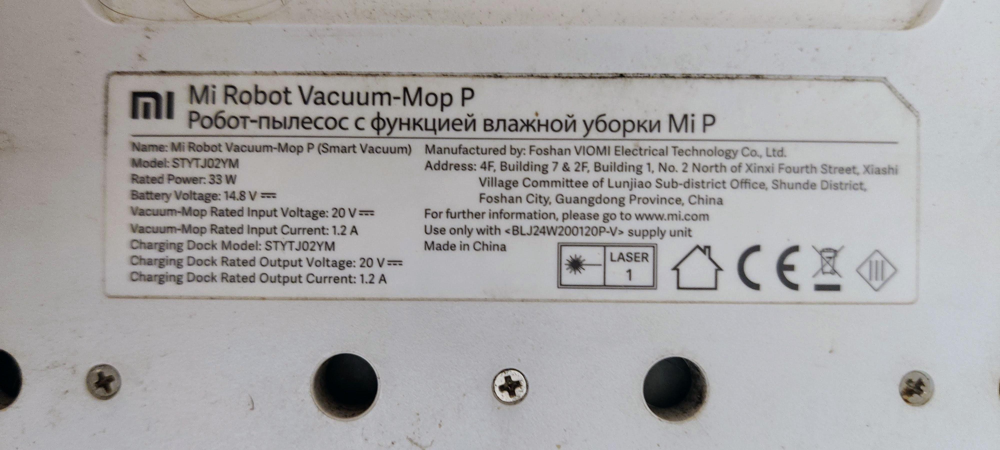
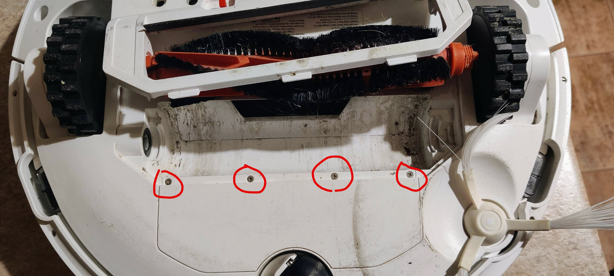
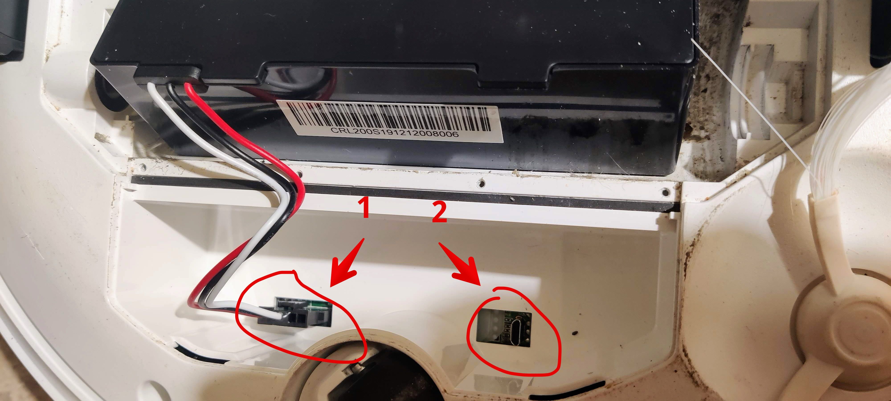
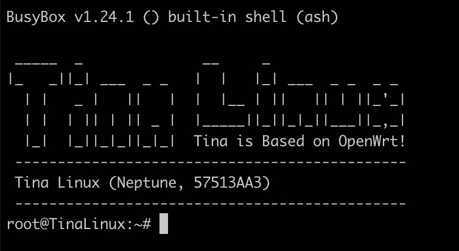

Сучасний робот пилосос оснащено камерою, радаром і бог зна ще чим. При цьому усьому він завжди має доступ до інтернет і, теоретично, може надсилати розмови, фото, адреси та карти ваших помешкання якомусь абстрактному Лі Хуан Чжану. А беручи до уваги те, що скоріш за все, у вашому будинку (_та й на вас самих і ймовірно на усіх членах вашої родини_) окрім робота пилососа ще купа різної іншої "розумної" техніки, то й же Лі Хуан Чжан, якщо того захоче, може знати про вас стільки всього, що ви й самі про себе не здогадуєтесь. Серцевий ритм, кількість кисню у крові, температуру повітря і підлоги у ваших кімнатах, яскравість освітлення... Ще трохи і вони будуть знати ваш гормональний фон. Страшне 😬

Отже, час від часу я замислювався над необхідністю відвʼязати робота пилососа від китайських "хмар" і використовувати його виключно локально. Під час рісьорчу знайшов штуку під назвою [Valetudo](https://valetudo.cloud/), але для встановлення потрібний root доступ до операційної системи. Власне про це і пишу. Насправді в інтернетах вже достатньо матеріалів на цю тему. Але тут я спробував скомпілювати усе до купи, послідовно та українською мовою.

<!-- more -->

Для початку перекидаємо вашого dust sucker'а пузом догори. Бачимо наклєєчку.


Знімаємо рамку головної щітки, саму щітку і знаходимо чотири гвинта що потрібно викрутити малою хрестовою викруткою.


Знімаємо кришку, витягаємо батарейку, відключаємо її розʼєм (1) і підключаємо дріт microUSB (2), але ще не підключаємо компʼютер.


Справа в тому, що підключення до [ADB](https://en.wikipedia.org/wiki/Android_Debug_Bridge) сервера на девайсі можливе лише впродовж однієї-двох секунд з моменту завантаження операційної системи. Після цього робот закриває доступ до [ADB](https://en.wikipedia.org/wiki/Android_Debug_Bridge). До того ж підключення до shell нічого тобі не дасть тому, що попередньо потрібно замінити або відредагувати файл `/bin/adb_shell`. Наразі він має наступний контент:

```sh
#!/bin/sh
export ENV='/etc/adb_profile'
if [ $1 = '-' ];then
	/bin/login
elif [ $1 = '-c' ];then
	/bin/login -c "$2"
else
	/bin/login
fi
```

ми повинні замінити його на:

```sh
#!/bin/sh
export ENV='/etc/adb_profile'
exec /bin/sh "$@"
```

Для цього створюємо файл із назвою `adb_shell` будь де на вашому на компі. Пишемо у нього код наданий вище, а також встановлюємо йому execution bits.

```sh
touch adb_shell
chmod +x adb_shell
```

Для того щоб не "тиркати" команду `adb push -a adb_shell /bin/adb_shell` щосекундно вручну, виловлюючи той самий момент коли з ним можна взаємодіяти, пишемо в консолі отаке:

```sh
while true; do adb push -a adb_shell /bin/adb_shell | grep -v "no devices"; done
```

і чекаємо допоки не побачимо наступне:

```text
adb_shell: 1 file pushed, 0 skipped. 0.0 MB/s (100 bytes in 0.033s)
```

Після цього висмикуємо із робота дріт і підключаємо знову.
Виконуємо наступне, щоб вимкнути автозапуск основного процессу, який не дає нормально працювати через `adb`.
_NOTE: Спокійно, це безпечно тому, що тут ми видаляємо сімлінк на файл а не сам файл. Потім все відновимо._

```sh
while true; do (adb shell rm /etc/rc.d/S90robotManager && echo "Done") 2>&1 | grep -v "no devices"; done
```

Чекаємо на успішне виконання попередньої інструкції (якщо не вдалось відключаємо USB і повторюєм усе з початку).
Після цього вже можна спокійно підключатись за допомогою `adb shell`. Якщо ти бачиш шось отаке, то це успіх.



Тепер потрібно встановити [Dropbear](https://en.wikipedia.org/wiki/Dropbear_(software)) щоб уможливити підключення через [ssh](https://en.wikipedia.org/wiki/Secure_Shell). Звісно можна [зібрати його із сирців](https://github.com/mkj/dropbear) але простіше [скачати готовий бінарник](assets/vacuum-stytj02ym/dropbear_2015.71-2_sunxi.ipk) і встановити його.

```bash
adb push dropbear_2015.71-2_sunxi.ipk /tmp
adb shell opkg install /tmp/dropbear_2015.71-2_sunxi.ipk
adb shell sed -i -e "/PasswordAuth/ s/off/on/g" /etc/config/dropbear
```

- пушимо його з компа на пилосос
- інсталюємо на пилососі
- дозволяємо підключення за допомогою пароля

Відключаємось від USB пилососа. Тепер можна підключити назад його батарейку, чекаємо на завантаження і підключаємось по ssh.

```sh
ssh root@vacuum.home
```

Де `vacuum.home` - IP адреса вашого робота у локальній мережі. Він запитає вас пароль, використай оце `@3I#sc$RD%xm^2S&`. Наступною командою виконай:

```sh
passwd
```

Тепер він запитає тебе новий пароль два рази. Далі можна встановити ssh ключ `/etc/dropbear/authorized_keys` якщо хочеш, але то не обовʼязково.

І от тепер можна "повернути до життя" головний процес пилососа.

```bash
cd /etc/rc.d
ln -s ../init.d/robotManager S90robotManager
```

Тобто тут ми повертаємо назад сімлінку яку видалили раніше.

Всьо, можна збирати і перезавантажувати робота. Тепер можна спокійно підключатись до нього по ssh у разі потреби.

## Джерела

- https://itooktheredpill.irgendwo.org/2020/rooting-xiaomi-vacuum-robot/
- https://blog.lupin.rocks/fixing-xiaomi-styj02ym-update-stuck-on-80/
- https://github.com/rumpeltux/viomi-rooting
- https://github.com/rumpeltux/viomi-rooting/blob/master/viomi-root.sh#L208
