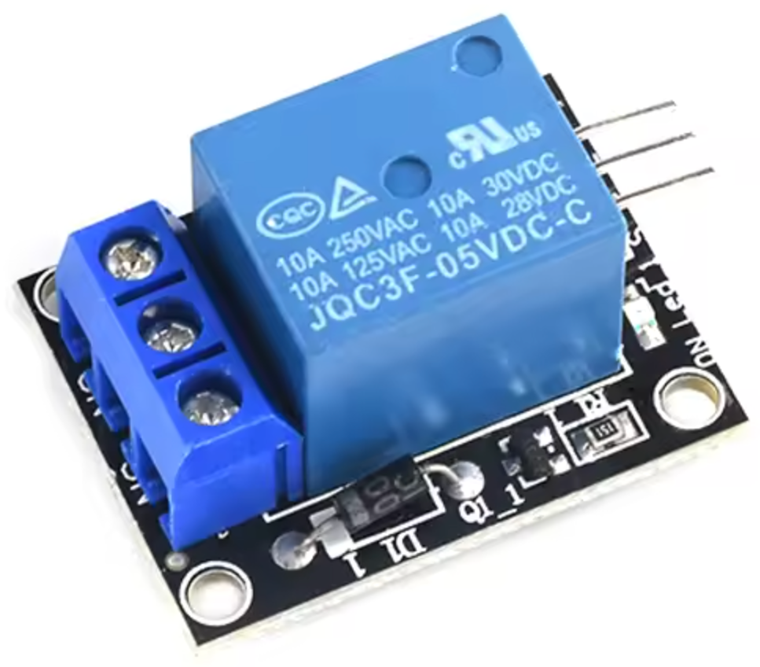
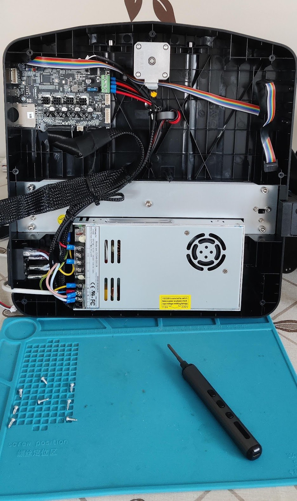
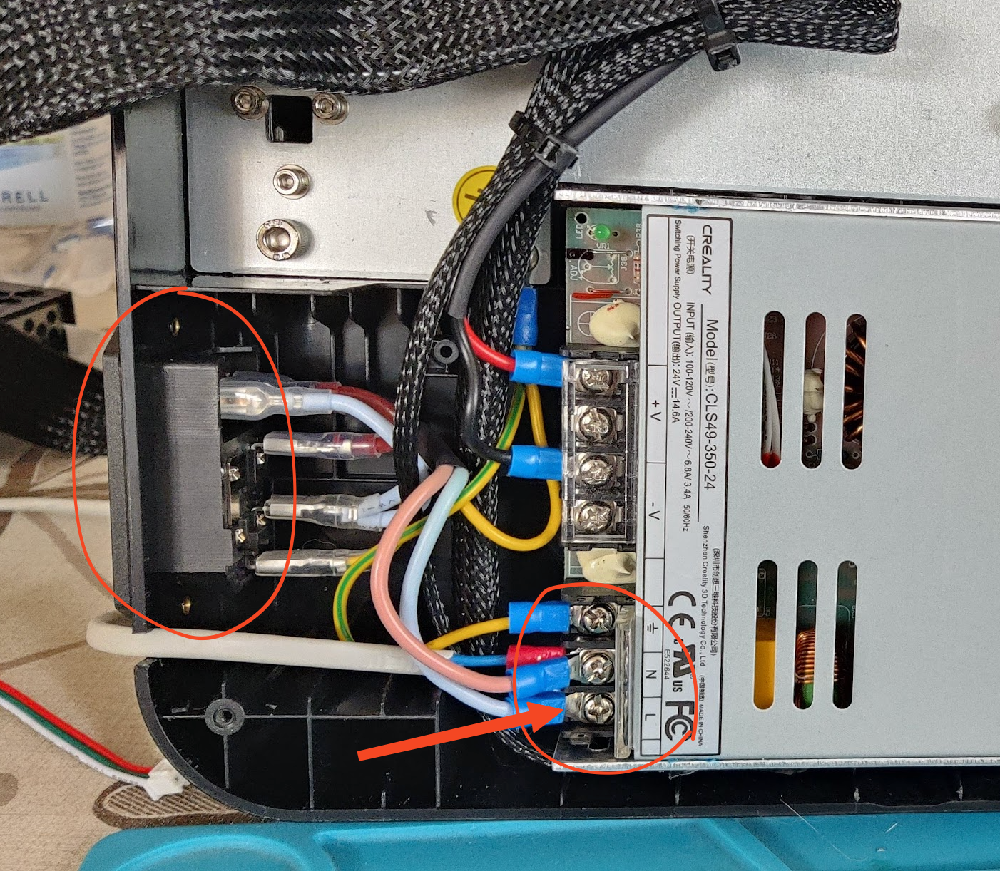
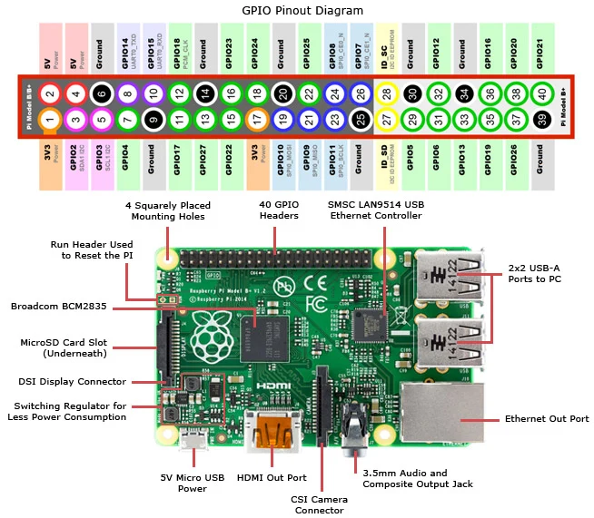

Маю вдома дешевий 3D-принтер Creality Ender 3 V3 SE. Підключив я до нього Raspberry Pi, перепрошив на Klipper, і все стало набагато краще та зручніше, але ж він, падлюка, гучний. Ну і одна справа, коли він зайнятий корисною роботою, а інша — коли закінчив і просто чекає. Або коли ти його щойно увімкнув.

"Я ж паяльнік", — подумав я і вирішив вбудувати в ланцюг живлення принтера реле, яке можна вмикати чи вимикати через GPIO пін на "малині". Блок живлення у ньому споживає до 3.4А при 230V, тож модуля типу **KY-019 5V** буде достатньо.



## 🛠 Розбираємо принтер

Кладемо принтер на "спину", відкручуємо його залізне дно, від'єднуємо шлейф вентилятора охолодження, і нам відкривається наступна картина.



## ✂︎ Підключення реле до блока живлення принтера

Знизу — той самий блок живлення.
На наступному фото стрілкою вказано, в розрив якого саме проводу треба включити реле.



## 📌 Підключення реле до Raspberry Pi

Далі цей релейний модуль треба підключити до Raspberry Pi. У моєму випадку це Raspberry Pi 3 B+, тож, дивлячись на наступну схему, можна обрати, до яких саме пінів.



### Я обрав наступні піни

- IN (на реле) 👈 GPIO17 (PIN 11)
- VCC (на реле) 👈 5V (PIN 2)
- GND (на реле) 👈 GND (PIN 6)

## 🧪 Перевірка

Вмикаємо все це "господарство", чекаємо на завантаження ОС "маліни" і тестуємо.

```sh
# Експортувати пін
echo "17" > /sys/class/gpio/export

# Зробити його виходом
echo "out" > /sys/class/gpio/gpio17/direction

# Встановити HIGH
echo "1" > /sys/class/gpio/gpio17/value

# Встановити LOW
echo "0" > /sys/class/gpio/gpio17/value
```

## Ubuntu

Якщо у вас Ubuntu чи щось подібне, треба буде встановити пакет для роботи з GPIO пінами.

```sh
sudo apt update
sudo apt install gpiod
```

Увімкнути реле:

```sh
gpioset gpiochip0 17=1
```

Вимкнути реле:

```sh
gpioset gpiochip0 17=0
```

## Тюнимо Moonraker

Спочатку я вигадував `systemd` сервіс, що перемикає стан піна, але потім знайшов простіший і прикольніший варіант.
[У документації Moonraker є розділ про компонент `power`](https://moonraker.readthedocs.io/en/latest/configuration/#power). Це саме те, що нам потрібно. Тож до конфігурації Moonraker додаємо налаштування для цього реле. У моєму випадку я зробив наступне.

```ini
# Control a relay providing power to the printer
# @see https://moonraker.readthedocs.io/en/latest/configuration/#options-common-to-all-power-devices
[power printer]
type: gpio
pin: gpio17
initial_state: off
off_when_shutdown: False
locked_while_printing: True
on_when_job_queued: True
restart_klipper_when_powered: True
restart_delay: 3
```

Перезавантажуємо Moonraker і вуаля... Маємо ось такий файний перемикач, яким можна увімкнути чи вимкнути "гудєлку", коли це потрібно.


## Джерела

- [Moonraker power component @moonraker.readthedocs.io](https://moonraker.readthedocs.io/en/latest/configuration/#power)
- [Raspberry Pi Pinout Diagram | Circuit Notes @jameco.com](https://www.jameco.com/Jameco/workshop/CircuitNotes/raspberry-pi-circuit-note.html)
